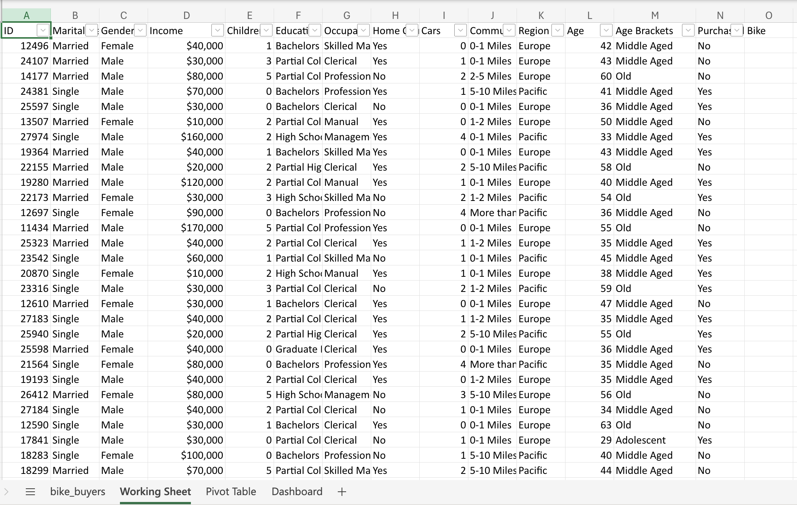
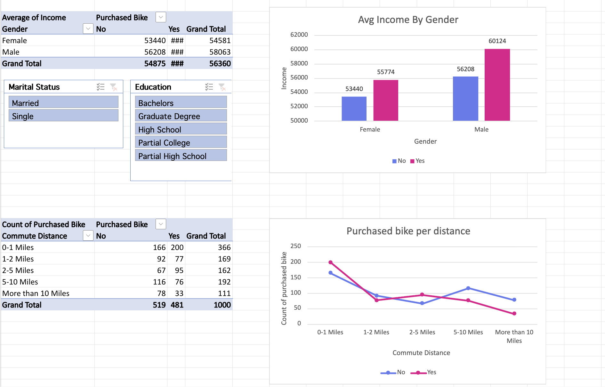
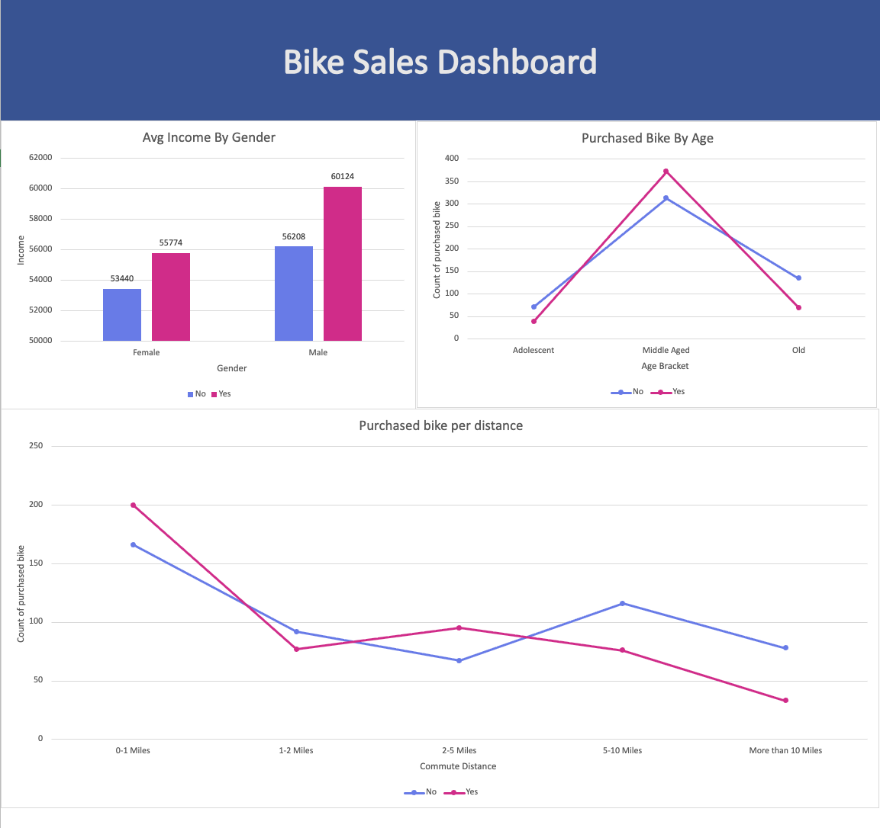

# 📊 Bike Sales Analysis Dashboard (Excel)

## 📌 Project Overview
This project focuses on analyzing customer bike purchase behavior using **Microsoft Excel**.  
The goal is to transform raw sales data into **actionable business insights** through data cleaning, PivotTables, and an interactive dashboard.

The dashboard enables stakeholders to understand how factors such as **income, age group, gender, marital status, and commute distance** influence bike purchasing decisions.

---

## 🎯 Business Objectives
- Identify key customer segments more likely to purchase bikes  
- Analyze income patterns across different demographics  
- Understand the impact of commute distance on purchase decisions  
- Enable **self-service analytics** for non-technical stakeholders  

---

## 📂 Dataset Description
- **Records:** 1,000+ customer entries  
- **Data Type:** Structured sales and demographic data  
- **Key Fields:**  
  - Gender  
  - Age Group  
  - Marital Status  
  - Income  
  - Commute Distance  
  - Purchased Bike (Yes/No)

---

## 🧹 Data Cleaning & Preparation
- Standardized categorical values (e.g., Gender, Marital Status)  
- Removed inconsistencies and ensured uniform formatting  
- Prepared clean data for PivotTable analysis  

---

## 📈 Analysis Performed
- Average income comparison by gender and purchase status  
- Bike purchase trends across age groups  
- Purchase behavior based on commute distance  
- Customer segmentation using demographic attributes

  ## 📈 Pivot Table Analysis
 

---

## 📊 Dashboard Features
- Interactive **PivotCharts** for visual analysis  
- **Slicers** for dynamic filtering by:
  - Gender  
  - Marital Status  
  - Age Group  
- Clean, executive-style dashboard layout for quick insights

  ## 📊 Dashboard Preview

---

## 🔍 Key Insights
- Middle-aged customers show the highest bike purchase rates  
- Higher income groups are more likely to purchase bikes  
- Shorter commute distances correlate with increased purchase likelihood  
- Demographic-based filtering reveals distinct customer behavior patterns  

---

## 🛠 Tools & Techniques Used
- Microsoft Excel  
  - PivotTables  
  - PivotCharts  
  - Slicers  
  - Data Cleaning  
  - Dashboard Design  

---
